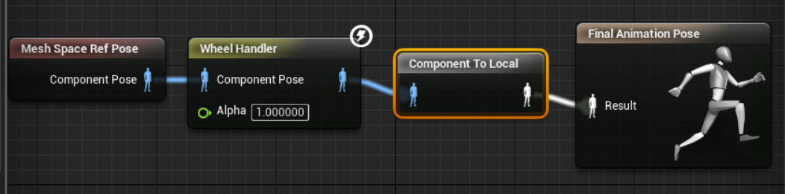

# アニメーション

* VehicleAnimInstance を継承し AVehicle_SkelMesh を指定して ABP_Vehicle を作成 Create ABP_Vehicle interit VehileAnimInstance and use AVehile_SkelMesh
    * Anim Graph へ Mesh Space Ref Pose、AWheel Handler を追加する Addd Mesh Space Pose and AWheel Handle to Anim Graph

